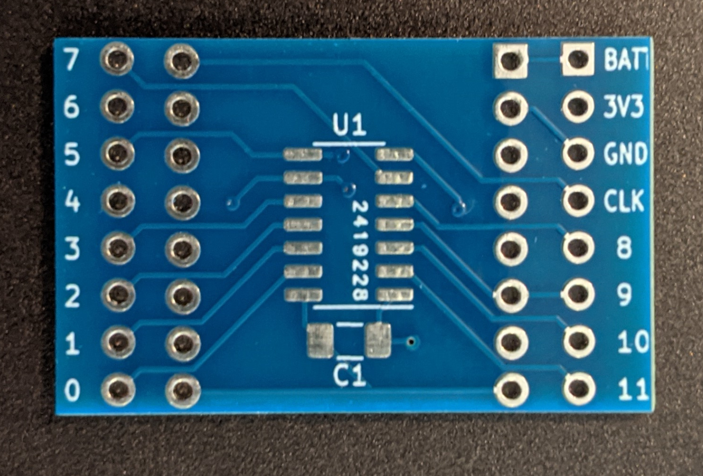
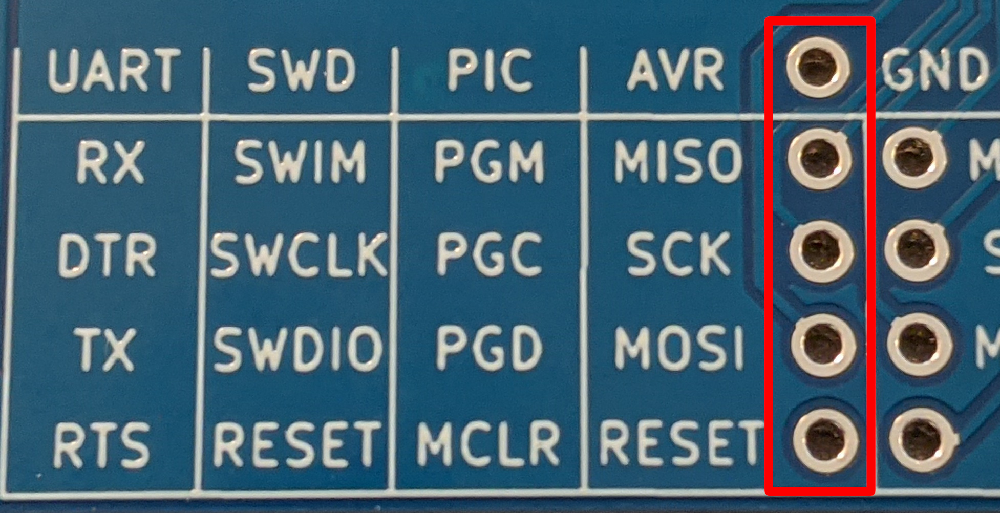
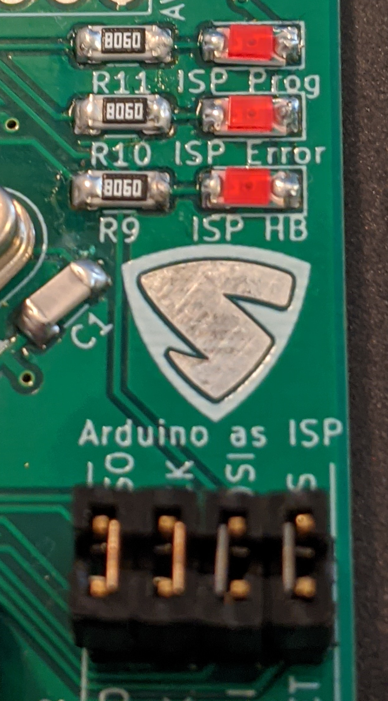

# Saintcon Minibadge Development Platform

### [Minibadge specification](https://github.com/lukejenkins/minibadge)


## ATtiny841 Development Board

The kits sold at SAINTCON 2021 came with a minibadge that had an attiny841 and a 1μF capacitor.



The 16 pins (8 each side) closest to the ATtiny841 are the minibadge connections. The square pin is an indicator for pin 1 of the minibadge spec.

* SDA and SCL are connected to the attiny's i2c interface from the minibadge socket.
  * SDA -> ATtiny pin 6
  * SCL -> ATtiny pin 4
* All 4 PROG pins from the minibadge socket are connected to the ATtiny's programming interface
  * PROG 3 (MISO) -> ATtiny pin 5
  * PROG 4 (SCK)  -> ATtiny pin 4
  * PROG 5 (MOSI) -> ATtiny pin 6
  * PROG 6 (SS)   -> ATtiny pin 9*

The furthest 16 pins are breakout pins for prototyping your circuit.

* 0-11 is the clockwise pin numbering*
* BATT is connected directly to +VBATT from the minibadge socket. This can have any voltage from (3V3 to 5V)
* 3V3 and GND are connected to both the ATtiny841 and the minibadge power pins.
* CLK is connected to the minibadge socket and not the ATtiny. Any use of this pin will need to be external from the breakout board.

*_Attiny pins 9,10, and 11 are labeled different on the breakout board then the are in the attinycore._
_Pin 9 from the breakout is pin 11 in the core, 10 is 9 and 11 is 10._
_While the pinout is labeled as clockwise it seems that the reset pin does not_
_follow the pattern resulting in the following two pin number being off by 1._

-------

When programming these from the Arduino IDE you need to install a board definition to be able to compile code for it.
I recommend [ATTinyCore](https://github.com/SpenceKonde/ATTinyCore).

There are a lot of options for code compilation. I recommend:

* Choosing ATtiny441/841 (No bootloader) for target board
* 8MHz internal < 4.5V clock speed
* Clockwise pin mapping
* Slave only wire mode (if using i2c)

-------

If you would like to use the PROG interface of the minibadge socket they are
available via these 5 pins.



## Using the Debugger as a Programmer

The debugger has the capability to be used as an AVR programmer.

The bare minimum required to do this is connecting the 4 pins below the
SAINTCON logo with the 4 immediately below those as pictured.

The status LEDs (ISP Prog, ISP Error, ISP HB) are not provided with the debugger
however any 1206 SMD resistor LED pair will work.



While you can turn this into a programmer I would recommend purchasing a seperate
programmer and connecting the separate programmer according the the table on the
debugger. Using this as a programmer is convenient if you do not have on, but
that means you will have to program the debugger, then the minibadge, then restore
the code on the debugger.

## Programming the Debugger

For writing custom code for the debugger, it uses the following pins:

| Debugger Identifier          | Pin # |
|------------------------------|-------|
| SDA with LED and 4.7k pullup | 2     |
| SCL with LED and 4.7k pullup | 3     |
| Minibadge CLK Pin with LED   | 5     |
| ISP Prog LED                 | 7     |
| ISP Error LED                | 8     |
| ISP HB LED                   | 9     |
| ArduinoISP SS                | 10    |

The debugger works at 3.3v. This means the micro-controller (attiny32u4) has a maximum clock speed of 8MHz.
It is based on the Arduino Micro, but that operates at 16MHz so you have to modify the boards.txt file to
allow compilation.

The boards.txt file can be found in the arduino data directory which is listed in arduino preferences.


The path from the data directory should be `packages/arduino/hardware/avr/x.x.x/boards.txt`

In the boards.txt file find the section for the Arduino Micro and add these lines:

```txt
micro.menu.cpu.16MHz=16 MHz
micro.menu.cpu.8MHz=8 MHz

micro.menu.cpu.16MHz.build.f_cpu=16000000L
micro.menu.cpu.8MHz.build.f_cpu=8000000L
```

Then in the same section find and comment out this line like so:

```txt
# micro.build.f_cpu=16000000L
```

Restart arduino and you should now have the clock speed option for the Micro.


#### If there is no boards.txt file

If you cannot find the boards.txt file then manually installing a different version of Arduino's board definitions will make it appear.

This can be done by going to the Board Manager in Arduino:

Tools -> Boards -> Board Manager

Find the Arduino AVR Boards section and downgrade it by 1 version if it is up to date, otherwise update and it should make the boards.txt file appear.

#### Alternatives to Modifying Boards.txt

I have not tested it, but you may be able to use `Lilypad Arduino USB` as the
board instead of `Arduino Micro`. I do know that the USB status LEDs are inverted
but I am unaware if there are additional differences between the two board 
definitions.

## Code examples

The minibadge debugger is designed to be used with the minibadge debugger code
which provides a serial terminal where commands can be sent to test all current
documented functionality.

There is also an I2C EEPROM programmer for 24CW style roms.
