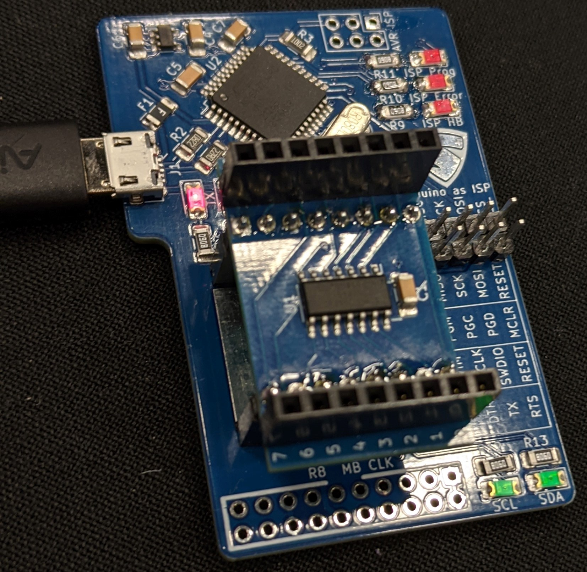
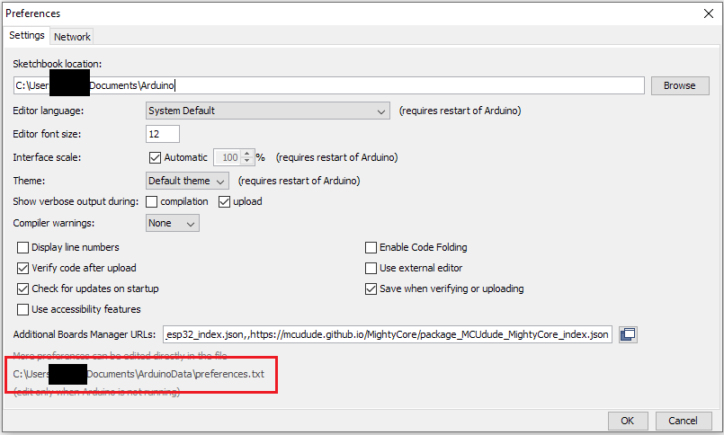
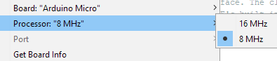

# Saintcon Minibadge Development Platform



## Attiny841 Development Board
The kits sold at SAINTCON in 2021 came with a minibadge that had an attiny841 and a 1μF capacitor.

When programming these from the arduino IDE you need to install a board definition to be able to compile code for it. I recomend [ATTinyCore](https://github.com/SpenceKonde/ATTinyCore).

There are a lot of options for compilation. I recomend:
* Choosing ATtiny441/841 (No bootloader) for target board
* 8MHz internal < 4.5V clock speed
* Clockwise pin mapping
* Slave only wire mode


## Programming Debugger
The debugger works at 3.3v. This means the micro-controller (attiny32u4) has a maximum clock speed of 8MHz.
It is based on the Arduino Mico, but that opperates at 16MHz so you have to modify the boards.txt file to
allow compilation.

The boards.txt can be found in the arduino data directory which is listed in arduino preferences.



The path is `packages/arduino/hardware/avr/x.x.x/boards.txt`

Edit that file and find the section for the Arduino Micro and add these lines:
```
micro.menu.cpu.16MHz=16 MHz
micro.menu.cpu.8MHz=8 MHz

micro.menu.cpu.16MHz.build.f_cpu=16000000L
micro.menu.cpu.8MHz.build.f_cpu=8000000L
```
Comment out this line:
```
# micro.build.f_cpu=16000000L
```

After a restart you should now have the clock speed option.




If you cannot find the directory you need to go to Tools -> boards -> Board Manager

Find the Arduino AVR Boards section and downgrade it by 1 version.

## Code examples
The minibadge debugger is designed to be used with the minibadge debugger code 
which provides a serial terminal where commands can be sent to test all current 
documented functionality.

There is also an I2C EEPROM programmer for 24CW style roms.